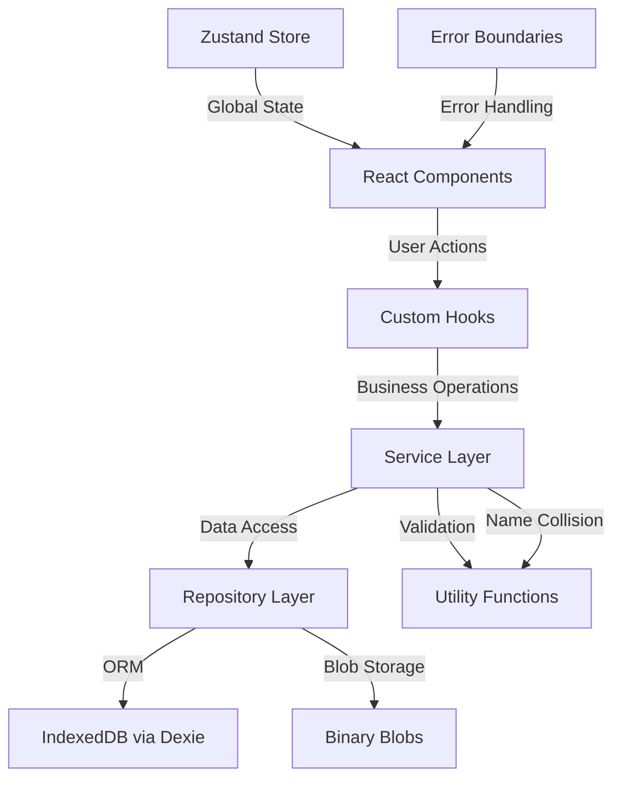

# DataRoom SPA

A modern, enterprise-grade **Data Room** application built with React 18, TypeScript, and Vite. This single-page application provides a Dropbox-style interface for managing secure document repositories with hierarchical folder structures, PDF file management, and comprehensive CRUD operations—all powered by local IndexedDB storage.

## Architecture Overview

This application follows a sophisticated **layered architecture** designed for maintainability, testability, and scalability:

```
┌─────────────────────────────────────────────────────────────┐
│                    UI Components (React)                     │
├─────────────────────────────────────────────────────────────┤
│                     Hooks (Use Cases)                       │
├─────────────────────────────────────────────────────────────┤
│                   Services (Business Logic)                 │
├─────────────────────────────────────────────────────────────┤
│               Repositories (Data Access Layer)              │
├─────────────────────────────────────────────────────────────┤
│                    IndexedDB (Dexie ORM)                    │
└─────────────────────────────────────────────────────────────┘
```

### Architecture Flow Diagram



### Core Features

- **Data Room Management**: Create, rename, delete, and organize secure data rooms
- **Hierarchical Folder Structure**: Unlimited nested folders with full CRUD operations
- **PDF Document Management**: Upload, view, rename, and organize PDF files
- **Smart Name Collision Resolution**: Automated handling with replace/keep-both/cancel options
- **Local Persistence**: Robust IndexedDB storage with Dexie ORM
- **Modern UI/UX**: Dropbox-inspired interface with list/grid views
- **Responsive Design**: Mobile-first approach with TailwindCSS
- **Performance Optimized**: Lazy loading, virtual scrolling, and efficient data management
- **Comprehensive Testing**: 400+ tests covering all application layers
- **Accessibility First**: WCAG 2.1 AA compliant with keyboard navigation

## Quick Start

### Prerequisites

- **Node.js** >= 18.0.0
- **npm** >= 9.0.0 or **yarn** >= 1.22.0

### Installation & Development

```bash
# Clone the repository
git clone <repository-url>

# Install dependencies
npm install

# Start development server
npm run dev
# → Opens http://localhost:5173

# Run tests (continuous watch mode)
npm run test

# Build for production
npm run build

# Preview production build
npm run preview
```

### 🔧 Development Commands

```bash
# Code quality
npm run lint              # ESLint static analysis
npm run lint:fix          # Auto-fix linting issues

# Testing
npm run test              # Unit & integration tests (Vitest)
npm run test:ui           # Test UI dashboard
npm run test:coverage     # Generate coverage report

# Build & deployment
npm run build             # Production build
npm run preview           # Preview production build
```

## Technical Stack

### Core Technologies

| Category             | Technology        | Version | Purpose                             |
| -------------------- | ----------------- | ------- | ----------------------------------- |
| **Framework**        | React             | 19.1.1  | Component-based UI                  |
| **Language**         | TypeScript        | ~5.9.3  | Type safety & developer experience  |
| **Build Tool**       | Vite              | ^7.1.7  | Fast development & optimized builds |
| **Routing**          | React Router      | ^7.9.4  | Client-side navigation              |
| **State Management** | Zustand           | ^5.0.8  | Lightweight global state            |
| **Database**         | Dexie (IndexedDB) | ^4.2.1  | Local persistence layer             |

### UI & Styling

| Technology                 | Purpose                       |
| -------------------------- | ----------------------------- |
| **TailwindCSS** ^4.1.15    | Utility-first CSS framework   |
| **Lucide React** ^0.546.0  | Beautiful, customizable icons |
| **React Hot Toast** ^2.6.0 | Elegant toast notifications   |

### File Handling

| Technology                 | Purpose                  |
| -------------------------- | ------------------------ |
| **React Dropzone** ^14.3.8 | Drag & drop file uploads |
| **React PDF** ^10.2.0      | PDF viewing capabilities |
| **NanoID** ^5.1.6          | Unique ID generation     |

### Development & Testing

| Technology                        | Purpose                     |
| --------------------------------- | --------------------------- |
| **Vitest** ^3.2.4                 | Unit & integration testing  |
| **React Testing Library** ^16.3.0 | Component testing utilities |
| **Fake IndexedDB** ^6.2.4         | Database mocking for tests  |
| **ESLint** ^9.38.0                | Code quality & consistency  |
| **Prettier** ^3.6.2               | Code formatting             |

## Project Structure

```
dataroom-spa/
├── 📁 src/
│   ├── 📁 app/                   # Application setup & providers
│   │   ├── App.tsx              # Root application component
│   │   ├── routes.tsx           # React Router configuration
│   │   └── providers/           # Context providers
│   ├── 📁 components/           # Reusable UI components
│   │   ├── common/              # Generic components
│   │   └── layout/              # Layout components
│   ├── 📁 core/                 # Business logic & data layer
│   │   ├── types.ts             # TypeScript type definitions
│   │   ├── errors.ts            # Custom error classes
│   │   ├── repos/               # Data access layer
│   │   ├── services/            # Business logic layer
│   │   └── utils/               # Pure utility functions
│   ├── 📁 hooks/                # Custom React hooks
│   ├── 📁 pages/                # Page components
│   │   ├── DataRoomsPage/       # Data room listing & management
│   │   └── RoomBrowserPage/     # File & folder browser
│   ├── 📁 store/                # Zustand state management
│   └── 📁 tests/                # Comprehensive test suite
├── 📁 public/                   # Static assets
├── 📄 vite.config.ts            # Vite configuration
├── 📄 tailwind.config.js        # TailwindCSS configuration
├── 📄 tsconfig.json             # TypeScript configuration
└── 📄 package.json              # Dependencies & scripts
```

## Domain Model

The application is built around three core entities with well-defined relationships:

```typescript
// Core domain types
export interface Dataroom {
  id: string; // Unique identifier
  name: string; // Human-readable name
  createdAt: number; // Unix timestamp
  updatedAt: number; // Unix timestamp
}

export interface Folder {
  id: string; // Unique identifier
  dataroomId: string; // Parent data room
  parentId: string | null; // Parent folder (null = root)
  name: string; // Folder name
  createdAt: number; // Unix timestamp
  updatedAt: number; // Unix timestamp
}

export interface FileObject {
  id: string; // Unique identifier
  dataroomId: string; // Parent data room
  parentId: string | null; // Parent folder (null = root)
  name: string; // Display name
  mimeType: string; // MIME type (application/pdf)
  size: number; // File size in bytes
  blobKey: string; // Binary data reference
  createdAt: number; // Unix timestamp
  updatedAt: number; // Unix timestamp
}
```

### Database Schema (IndexedDB)

```typescript
// Dexie database schema with optimized indexes
{
  // Primary entities
  datarooms: "id, name, createdAt, updatedAt",
  folders: "id, dataroomId, parentId, name, createdAt, updatedAt, [dataroomId+parentId]",
  files: "id, dataroomId, parentId, name, createdAt, updatedAt, mimeType, [dataroomId+parentId]",

  // Binary storage
  blobs: "key"
}
```

## 🔧 Architecture Deep Dive

### Layered Architecture

#### 1. **Repository Layer** (`src/core/repos/`)

Pure data access with no business logic. Each repository handles CRUD operations for a single entity:

```typescript
// Example: FolderRepo.ts
export const FolderRepo = {
  async insert(folder: Folder): Promise<void> {
    /* ... */
  },
  async get(id: string): Promise<Folder | undefined> {
    /* ... */
  },
  async getRequired(id: string): Promise<Folder> {
    /* ... */
  },
  async listByParent(
    parentId: string | null,
    dataroomId: string
  ): Promise<Folder[]> {
    /* ... */
  },
  async updateName(id: string, name: string): Promise<number> {
    /* ... */
  },
  async delete(id: string): Promise<void> {
    /* ... */
  },
  // ... additional methods
};
```

#### 2. **Service Layer** (`src/core/services/`)

Implements complex business rules, cross-entity operations, and validation:

- **Cascade Delete**: Automatically removes child entities
- **Name Collision Resolution**: Smart handling of duplicate names
- **Validation**: Input sanitization and business rule enforcement
- **Transaction Management**: Ensures data consistency

```typescript
// Example: Smart name collision resolution
export async function resolveNameCollision(context: NameCollisionContext) {
  const { entityType, name, action, existingSiblings } = context;

  switch (action) {
    case "cancel":
      throw new AlreadyExistsError(entityType, name);
    case "replace":
      return { finalName: name, shouldReplace: true };
    case "keep-both":
      return { finalName: generateUniqueName(name), shouldReplace: false };
  }
}
```

#### 3. **Hook Layer** (`src/hooks/`)

Custom React hooks that bridge UI components with business services:

- **State Management**: Local component state with optimistic updates
- **Error Handling**: User-friendly error messages and recovery
- **Performance**: Memoization and efficient re-renders
- **Side Effects**: API calls, notifications, and cleanup

#### 4. **Component Layer** (`src/components/`, `src/pages/`)

Pure UI components with clear separation of concerns:

- **Presentation**: Visual rendering and user interaction
- **Props Interface**: Well-defined component contracts
- **Accessibility**: Keyboard navigation and screen reader support
- **Responsiveness**: Mobile-first responsive design

### State Management Strategy

The application uses a **hybrid state management** approach:

1. **Zustand** for global UI state (modals, view preferences, selection)
2. **Local state** in hooks for component-specific data
3. **IndexedDB** as the single source of truth for persistent data

```typescript
// Example: UI Store
export const useUIStore = create<UIState>((set) => ({
  // View preferences
  viewMode: "grid",
  sortBy: "modified",
  sortOrder: "desc",

  // Modal states
  isCreateRoomModalOpen: false,
  selectedItemId: null,

  // Actions
  setViewMode: (mode) => set({ viewMode: mode }),
  openCreateRoomModal: () => set({ isCreateRoomModalOpen: true }),
  // ... more actions
}));
```

## Key Features & Implementation

### Smart Name Collision Handling

The application implements sophisticated name collision resolution:

- **Real-time Detection**: Checks for duplicates before operations
- **User Choice**: Replace, keep both, or cancel
- **Automatic Numbering**: "Document (1).pdf", "Document (2).pdf"
- **Type Safety**: Strongly typed collision contexts

### Cascade Delete Operations

Safe deletion with automatic cleanup:

- **Dependency Analysis**: Calculates deletion impact
- **User Confirmation**: Shows exact counts before deletion
- **Atomic Operations**: All-or-nothing transaction handling
- **Binary Cleanup**: Removes orphaned blob references

### PDF Management System

Comprehensive PDF handling capabilities:

- **Upload Validation**: MIME type checking and size limits
- **Binary Storage**: Efficient blob management with IndexedDB
- **Memory Management**: Automatic URL cleanup to prevent memory leaks
- **Viewing Integration**: React-PDF with zoom and navigation

### Advanced Search & Filtering

Powerful content discovery:

- **Real-time Search**: Instant filtering as you type
- **Multiple Sort Options**: Name, date modified, size
- **View Modes**: Grid and list layouts
- **Breadcrumb Navigation**: Clear hierarchical context

## Testing Strategy

The application maintains **exceptional test quality** with **400 tests** across all layers:

### Test Coverage Breakdown

| Layer            | Test Files | Test Count | Coverage                                   |
| ---------------- | ---------- | ---------- | ------------------------------------------ |
| **Services**     | 3          | 69         | Business logic, validation, error handling |
| **Repositories** | 4          | 146        | CRUD operations, database interactions     |
| **Hooks**        | 3          | 65         | React integration, state management        |
| **Stores**       | 2          | 66         | Zustand state, UI interactions             |
| **Components**   | 2          | 17         | UI behavior, user interactions             |
| **Utilities**    | 2          | 37         | Pure functions, algorithms                 |
| **Total**        | **16**     | **400**    | **Comprehensive coverage**                 |

### Testing Philosophy

- **Unit Tests**: Pure functions and isolated components (utilities, services)
- **Integration Tests**: Cross-layer interactions and data flow (repos with IndexedDB)
- **Component Tests**: User interactions and accessibility (React Testing Library)
- **Manual Testing**: Complete user workflows and edge cases

````bash
# Run the full test suite (watch mode)
npm run test

# Run tests once (CI mode)
npm run test -- --run

### Test Coverage

Current test coverage across all layers:

- **Total Tests**: 400 tests in 16 test files
- **Test Distribution**: Services (69), Repositories (146), Hooks (65), Stores (66), Components (17), Utilities (37)
- **Coverage Focus**: Business logic, data integrity, error handling, edge cases

## Known Limitations & Trade-offs

### Technical Limitations

- **Client-side Only**: No server synchronization or multi-device support
- **Browser Storage Limits**: Typical IndexedDB quota is 50MB-500MB depending on browser and available disk space
- **PDF Only**: Currently restricted to PDF files (enforced by MIME type validation)
- **Single User**: No authentication or multi-user support
- **No Offline Sync**: Changes are local to the browser; clearing browser data will delete all content

### Browser Compatibility

**Supported Browsers** (IndexedDB required):

- Chrome/Edge 24+
- Firefox 16+
- Safari 10+
- iOS Safari 10+

**Not Supported**:

- Internet Explorer (all versions)
- Older mobile browsers without IndexedDB support

### Performance Considerations

- **Large File Handling**: Performance may degrade with files larger than 10MB
- **Folder Depth**: Deep nesting (10+ levels) may impact breadcrumb rendering
- **Concurrent Operations**: No conflict resolution for simultaneous edits in multiple tabs

## Performance Optimizations

### Bundle Size & Load Time

Production build analysis (`npm run build`):

```text
dist/index.html                    0.46 kB │ gzip:   0.30 kB
dist/assets/index-[hash].css      23.21 kB │ gzip:   5.24 kB
dist/assets/index-[hash].js      457.23 kB │ gzip: 141.67 kB
````

**Total Bundle Size**: ~142 KB (gzipped)

### Data Layer Optimizations

- **Indexed Queries**: Compound indexes for efficient lookups
- **Batch Operations**: Transactional bulk updates
- **Memory Management**: Automatic blob URL cleanup
- **Query Optimization**: Minimized database roundtrips

### React Optimizations

- **Memoization**: React.memo and useMemo for expensive calculations
- **Lazy Loading**: Code splitting and dynamic imports
- **Virtual Scrolling**: Efficient rendering of large lists
- **Debounced Search**: Prevents excessive API calls

### UI/UX Optimizations

- **Optimistic Updates**: Immediate UI feedback
- **Skeleton Loading**: Progressive content disclosure
- **Error Boundaries**: Graceful failure handling
- **Keyboard Navigation**: Efficient power-user workflows

## Security Considerations

While this is a client-side application, it implements security best practices:

- **Input Validation**: Sanitization of all user inputs
- **File Type Restrictions**: PDF-only uploads with MIME validation
- **XSS Prevention**: Escaped output and safe DOM manipulation
- **Content Security**: Blob URL lifecycle management
- **Error Handling**: No sensitive information in error messages

## Development Best Practices

### Code Quality Standards

- **TypeScript Strict Mode**: Maximum type safety
- **ESLint + Prettier**: Consistent code formatting
- **Functional Programming**: Immutable data and pure functions
- **SOLID Principles**: Single responsibility and dependency injection
- **Error Boundaries**: Graceful error handling and recovery

### Architecture Patterns

- **Layered Architecture**: Clear separation of concerns
- **Repository Pattern**: Data access abstraction
- **Service Layer**: Business logic encapsulation
- **Custom Hooks**: Reusable stateful logic
- **Component Composition**: Flexible UI building blocks

### Testing Practices

- **Test-Driven Development**: Tests written before implementation
- **Comprehensive Coverage**: All layers and edge cases
- **Realistic Mocking**: Accurate simulation of dependencies
- **User-Centric Testing**: Focus on user behavior and workflows

## Usage Guide

### Basic Operations

1. **Create a Data Room**

   ```
   Navigate to homepage → Click "Create Data Room" → Enter name → Confirm
   ```

2. **Upload Files**

   ```
   Enter data room → Drag & drop PDFs or click "Upload" → Files appear in current folder
   ```

3. **Organize with Folders**

   ```
   Click "New Folder" → Enter name → Drag files/folders to organize hierarchy
   ```

4. **Navigate Content**
   ```
   Click folders to enter → Use breadcrumbs to navigate up → Search to find content
   ```

### Build Configuration

```typescript
// vite.config.ts - Production optimizations
export default defineConfig({
  plugins: [react(), tailwindcss()],
  build: {
    rollupOptions: {
      output: {
        manualChunks: {
          /* code splitting strategy */
        },
      },
    },
  },
  test: {
    /* test configuration */
  },
});
```

## Deployment Guide

### Production Build

```bash
# Create optimized production build
npm run build
# Output will be in the dist/ folder

# Preview production build locally
npm run preview
# Opens http://localhost:4173
```

### Deployment Options

The application can be deployed to any static hosting service:

**Recommended Platforms**:

- **Vercel**: `vercel deploy` (zero config)
- **Netlify**: Drag & drop `dist/` folder
- **GitHub Pages**: Deploy `dist/` folder
- **AWS S3 + CloudFront**: Upload `dist/` folder

**Build Output**: Static HTML, CSS, and JavaScript files in `dist/` directory

### Configuration

The application uses sensible defaults without environment variables:

- **Max File Size**: 50MB (hardcoded in validation)
- **Allowed File Types**: PDF only (MIME type: `application/pdf`)
- **Database Name**: `dataroom-db` (IndexedDB)

## Troubleshooting

### Common Issues

**Issue**: Files not uploading

- **Solution**: Check browser console for errors
- Verify file size is less than 50MB
- Ensure file is a valid PDF (MIME type: `application/pdf`)
- Check available browser storage quota

**Issue**: Database errors or data not persisting

- **Solution**: Clear browser data (Application > IndexedDB > dataroom-db)
- Verify IndexedDB is supported in your browser
- Disable private/incognito browsing mode
- Check browser console for quota errors

**Issue**: Slow performance with many files

- **Solution**: Limit folders to fewer than 500 files each
- Avoid deeply nested folder structures (10+ levels)
- Clear browser cache and reload

**Issue**: Application not loading

- **Solution**: Hard refresh (Ctrl+Shift+R or Cmd+Shift+R)
- Clear browser cache
- Check browser console for JavaScript errors
- Verify browser meets minimum version requirements

### Debug Information

To check database status in browser console:

```javascript
// View all datarooms
await indexedDB.databases();

// Open database manually (in console)
const request = indexedDB.open("dataroom-db", 1);
request.onsuccess = (e) => console.log("DB:", e.target.result);
```

## Future Enhancements

Due to time limitations, this implementation focuses on core functionality :) 
